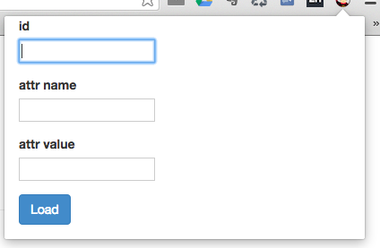

### これはなに

任意のページのDOMを変更するChrome拡張です

### 使い方

0. このパッケージをcloneする

0. app/manifest.jsonの"matches"に操作したいページのドメインを追加する

0. Google Chromeで'設定'->'拡張機能'を開く

0. 画面の右上にあるデベロッパーモードにチェックを入れる

0. 'パッケージ化されていない拡張機能を読み込む'で'app'ディレクトリを選択する

0. DOMを操作したいページを開く

0. 検索バーの隣にあるアイコンをクリックするとDOMを操作するためのPopupが表示され、以下の項目を編集する

    * id : 操作したいDOMのid
    * attr name : 属性名
    * attr value : 属性値
    * 

0. Loadボタンを押すとページがリロードされ、指定したDOMに変更が適用される


### 例)
```<div id="hoge"></div>``` の要素があるページで、

'id' => hoge, 'attr name' => data-hoge, 'attr value' => hogehoge 入力してLoadした場合

```<div id="hoge" data-hoge="hogehoge"></div>``` のようにDOMが変更される
