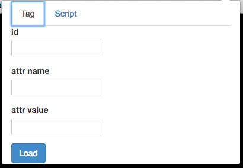
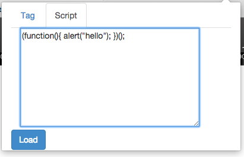

### これはなに

Webページに対して任意の変更を加えるChrome拡張です。

例えば、```<div id="hoge"></div>``` の要素を```<div id="hoge" data-hoge="hogehoge"></div>``` のように変更することができます。

また、任意のJavaScriptを埋め込んで実行することもできます。

### 使い方

#### 0. Chromeに取り込む

0. このパッケージをcloneする

0. app/manifest.jsonの"matches"に操作したいページのドメインを追加する

0. Google Chromeで'設定'->'拡張機能'を開く

0. 画面の右上にあるデベロッパーモードにチェックを入れる

0. 'パッケージ化されていない拡張機能を読み込む'で'app'ディレクトリを選択する


#### 1. タグを変更する

0. DOMを操作したいページを開く

0. 拡張機能のアイコンをクリックするとPopupが表示されるので、以下の項目を変更する。

    * id : 操作したいDOMのid
    * attr name : 属性名
    * attr value : 属性値
    * 

0. 'Load'ボタンを押すとページがリロードされ、指定したDOMに変更が適用される

#### 2. JavaScriptを埋め込む

0. JSを埋め込みたいページを開く

0. 拡張機能のアイコンをクリックし、タブを'Script'に切り替えると、textareaが表示されるので、そこに任意のjavascriptを記述する

    * 

0. 'Load'ボタンを押すとページがリロードされ、任意のJavaScriptが埋め込まれる
